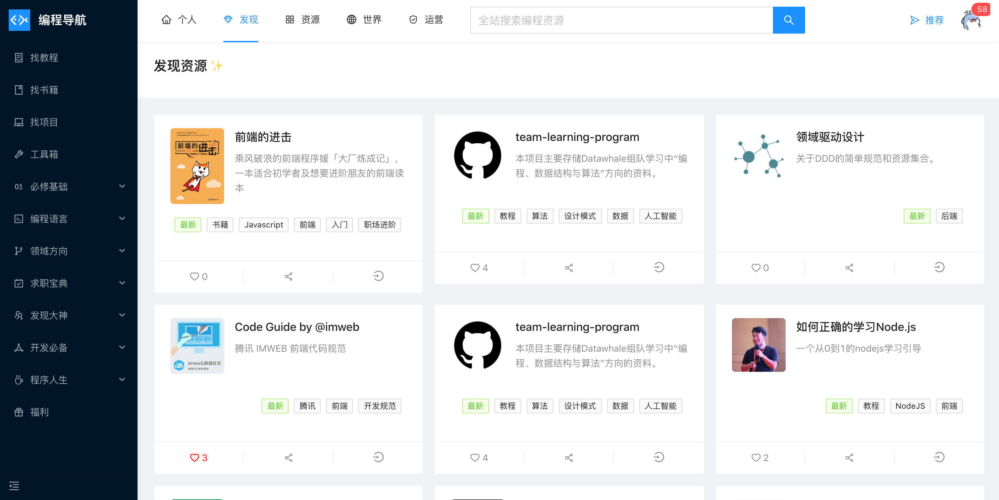
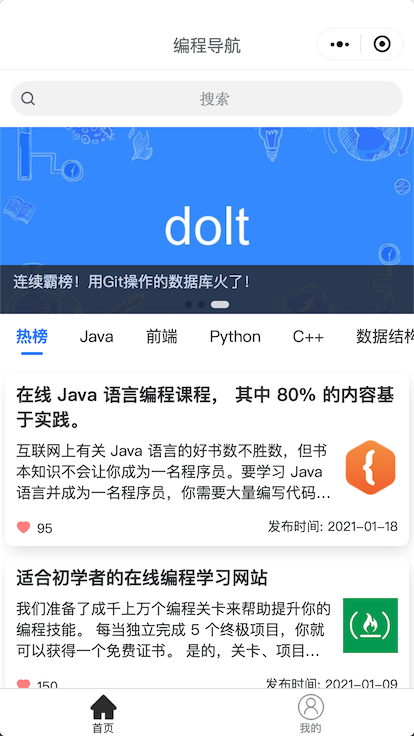
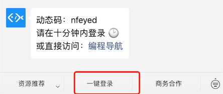
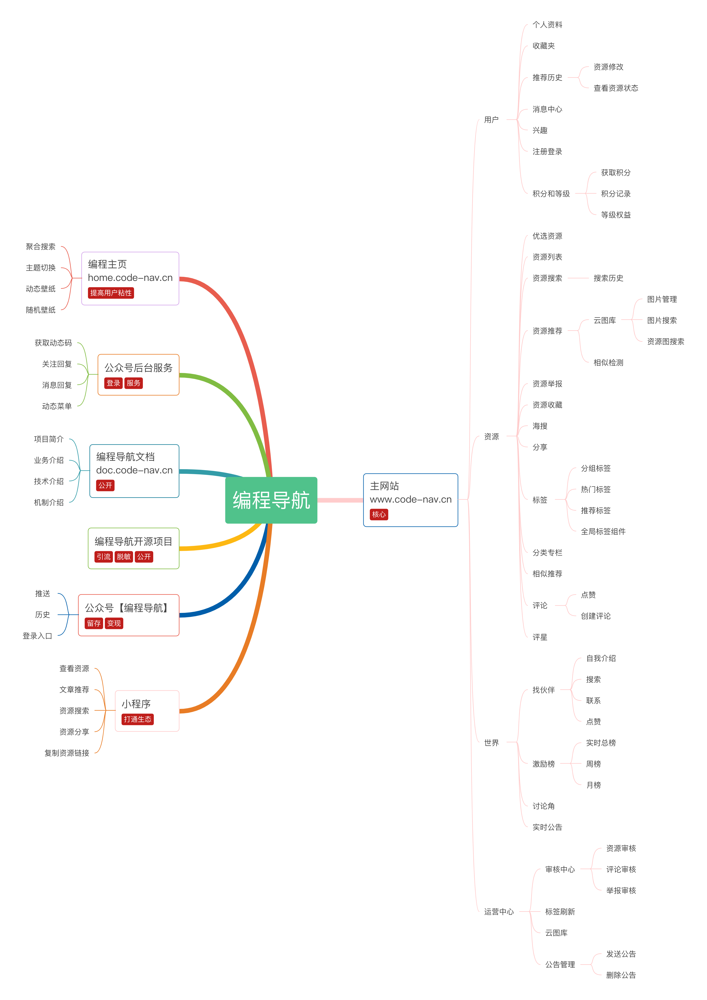

# 编程导航
<!-- ALL-CONTRIBUTORS-BADGE:START - Do not remove or modify this section -->

<!-- ALL-CONTRIBUTORS-BADGE:END -->

> 专业灵活的编程导航站，发现优质编程学习资源！微信公众号『 编程导航 』
>
> 另外一个项目：[免费编程资源大全](https://github.com/liyupi/free-programming-resources) ，对优质资源做了进一步整理！

## 项目介绍

编程导航不仅仅是一个网站，而是以 **“帮助大家发现优质编程资源，提升学习效率”** 为目标的完整生态。

包含多个子项目，技术栈包括 React、Java SpringBoot、腾讯云云开发等，都开源给大家学习，让你也能轻松开发精美的信息导航类网站！

进入对应目录可查看子项目详情：

| 子项目                                                       | 描述                                     | 目录                                       |
| ------------------------------------------------------------ | ---------------------------------------- | ------------------------------------------ |
| 🔍 [编程导航主站](https://www.code-nav.cn)                    | 发现优质编程资源                         | [code-nav-main](./code-nav-main)           |
| 🏡 [编程主页](https://home.code-nav.cn)                       | 程序员必备主页                           | [code-nav-home](./code-nav-home)           |
| 📚 [编程导航文档](https://doc.code-nav.cn)                    | 项目使用指南和详情，深入了解项目必读     | [code-nav-doc](./code-nav-doc)             |
| 📱 [编程导航小程序](https://636f-codenav-8grj8px727565176-1256524210.tcb.qcloud.la/code-nav-mini.jpg) | 在微信中直接搜索资源、浏览优质文章       | [code-nav-mini](./code-nav-mini)           |
| 🌿 [编程导航公众号后台](https://qiniuyun.code-nav.cn/qrcode_for_gh_885a2912dab4_430(2).jpg) | 提供获取动态码、关注回复、动态菜单等服务 | [code-nav-mp-server](./code-nav-mp-server) |
| ☘️ [编程导航微信公众号](https://qiniuyun.code-nav.cn/qrcode_for_gh_885a2912dab4_430(2).jpg) | 分享、介绍、评测优质编程资源，不要错过！ | 无                                         |

 

## 项目展示

[编程导航主站 - 发现优质编程资源](https://www.code-nav.cn) 

[编程主页 - 程序员必备主页](https://home.code-nav.cn)

**编程导航 - 微信小程序**

**编程导航 - 微信公众号**

**编程导航 - 微信公众号后台**

[编程导航文档 - 深入了解项目](https://doc.code-nav.cn)

 

## 项目特色

- 多端适配响应式网站
- 提供测试数据，易学习、易接入
- 覆盖云开发大部分功能特性
- 支持容器部署，全量上云
- 遵循统一代码规范

 

## 站点由来

总是有很多学编程的朋友问我 “有没有学 xx 的资源”、“我需要 xx 资源，能发我一份么”。

在重复接收类似讯息后，我陷入深思。

如今编程资源获取的大环境雾气重重，有很多不太好的现象：

1. 很多名不副实的编程资源被捧上了天，名人效应、一叶障目
2. 好的编程资源被商业利益化，很多人利用信息差，将本来免费的资源进行贩卖
3. 好的编程资源由于作者不出名，没有被人发现
4. 网上的编程资源非常零散，真实性、有效性很不确定

意识到这些问题后，作为一个开发者，我可以做些什么？ 继续去网上搜好的资源，然后传到网盘上，分享给大家？

一个人的力量终归渺小，好的编程资源环境需要大家的共同努力。

这是『 编程导航 』问世的原因：**提供人人皆可推荐的编程资源导航平台，帮助大家发现优质编程资源。**

本质是 **资源碎片 => 列表化 => 文档化 => 系统化** 的过程。就像准备复习面试题一样，有人给你分享单一的面试题目（碎片）、有人分享题目列表（列表化）、有人分享一本面试小书（文档化），而这些在灵活性上远远不如一个 “可搜索”、“可复用”、“可量化” 、“可定制” 的 **资源系统**。

**想象一下，当你想要学习算法时，在系统上轻轻一点，优质算法学习资源尽收眼底，不是很棒么？**

作者在腾讯顶着上班的压力，熬了一个月的大夜，终于完成了基础版本，欢迎大家体验、推荐资源、提出意见！

整个项目也开源给大家，可供学习。觉得不错的话，求个 star、分享给身边的朋友吧，这对我非常重要 😭 有你们的支持才有前进的动力！

 

### QA

1. Q：编程类导航网站都烂大街了，为什么还要做导航？

   A：大多数编程导航网年久失修，也有不错的导航，但是在搜索、归类上比较局限，而且没有自主推荐、喜欢等功能，不具备可持续发展性。

2. Q：资源太多的话，会不会同样让人眼花缭乱，不知道看哪个？

   A：现在编程资源非常多，肯定会出现这种情况，这也是我们做 **系统** 而不是整理文档的原因。可以通过评分、评论、排序、推荐等方式缓解，大家觉得好的资源才会有更多被发现的机会！

3. Q：分享资源时直接给别人可访问的链接不就行了，为什么要从编程导航分享？
  
   A：的确，分享链接在很多场景下都很方便。但如果分享资源时，能让他人直接看到资源的描述、详情，可以更快地帮助他人使用和理解。还可以通过评论区来对资源的质量进行区分。后续还会为每个资源添加视频介绍，帮助大家快速上手！

 

## 全部功能

一张思维导图足矣，详细介绍请进入 [对应项目子目录 ](#项目介绍)。

 

## 站内精品

 

## 版本

| 日期                | 版本       | 详情                                             |
| ------------------- | ---------- | ------------------------------------------------ |
| 2021 年 01 月 10 日 | 0.0.1 内测 | 编程导航主站基本功能完成                         |
| 2021 年 01 月 20 日 | 0.0.2 公测 | 编程导航主站、编程导航主页、微信服务端上线，开源 |

 

## 联系作者

作者微信 `code_nav` ，添加时请备注事由，开门见山。

 

## 贡献指南

1. [提交产品或 Bug 反馈意见](https://support.qq.com/products/303921)

 

## 致谢
liyupi ringozzt jonssonyan

## Contributors ✨

Thanks goes to these wonderful people ([emoji key](https://allcontributors.org/docs/en/emoji-key)):

<!-- ALL-CONTRIBUTORS-LIST:START - Do not remove or modify this section -->
<!-- prettier-ignore-start -->
<!-- markdownlint-disable -->
<table>
  <tr>
    <td align="center"><a href="https://www.code-nav.cn"> <b>程序员鱼皮</b></a> <a href="#ideas-liyupi" title="Ideas, Planning, & Feedback">🤔</a></td>
    <td align="center"><a href="https://yuqing521.github.io/"> <b>wxy521</b></a> <a href="https://github.com/liyupi/code-nav/commits?author=yuqing521" title="Code">💻</a></td>
    <td align="center"><a href="https://github.com/ringozzt"> <b>Ringo</b></a> <a href="https://github.com/liyupi/code-nav/commits?author=ringozzt" title="Code">💻</a></td>
    <td align="center"><a href="https://github.com/LeBronChao"> <b>前端LeBron</b></a> <a href="https://github.com/liyupi/code-nav/commits?author=LeBronChao" title="Code">💻</a></td>
    <td align="center"><a href="http://jonssonyan.com"> <b>Jonsson Yan</b></a> <a href="https://github.com/liyupi/code-nav/commits?author=jonssonyan" title="Code">💻</a></td>
  </tr>
</table>

<!-- markdownlint-restore -->
<!-- prettier-ignore-end -->

<!-- ALL-CONTRIBUTORS-LIST:END -->

This project follows the [all-contributors](https://github.com/all-contributors/all-contributors) specification. Contributions of any kind welcome!