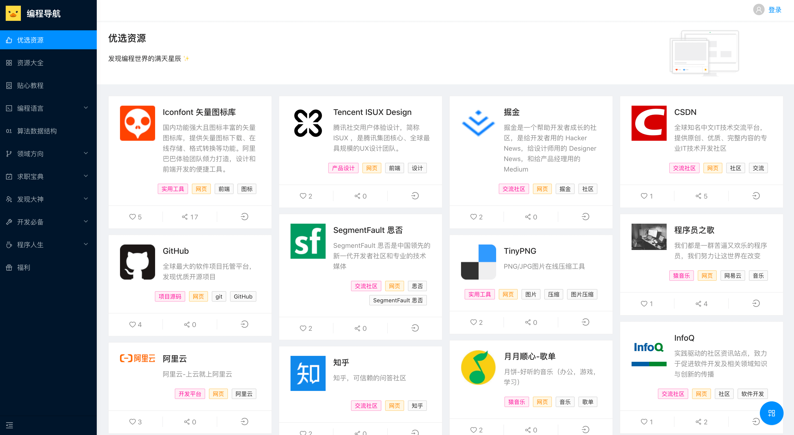
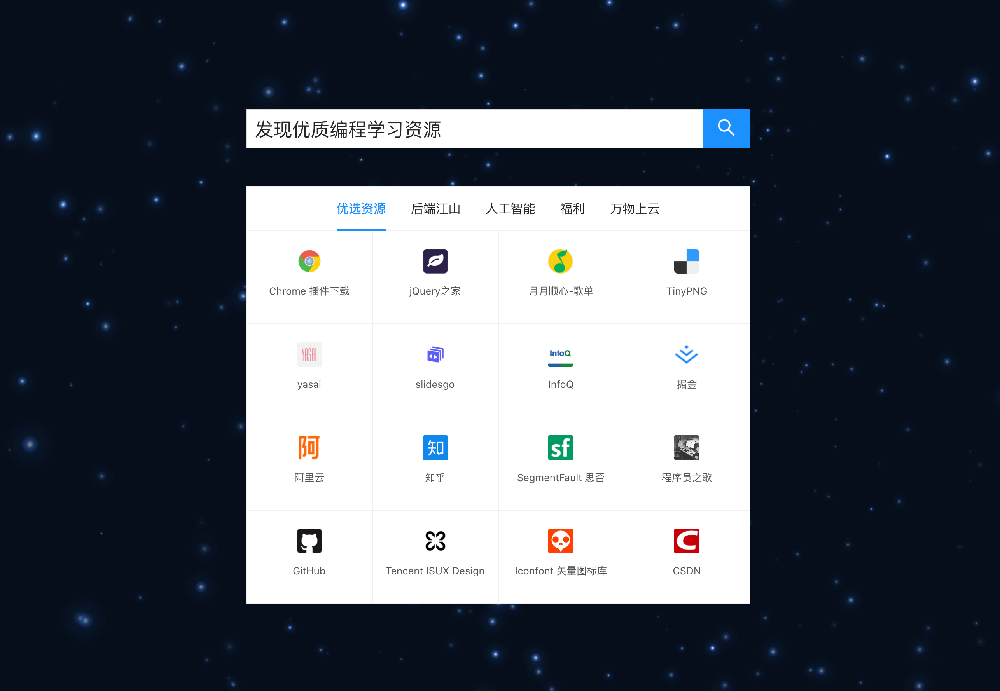

# 编程导航

> 最专业灵活的导航站点，发现优质编程学习资源！微信公众号『 编程导航 』

在线网站：https://www.code-nav.cn


本项目是『 编程导航 』网站的开源版本，使用这套代码，你也能轻松开发多端适配网站！

**当然目前代码中保留了部分业务隐私，后续会逐渐公开~** 

<br/>

## 项目展示





<br/>

## 写在前面

总是有很多学编程的朋友问我 “有没有学 xx 的资源”、“我需要 xx 资源，能发我一份么”。

在重复接收到这样的讯息后，我发现如今编程资源获取的大环境雾气重重，有一些不太好的现象：

1. 很多名不副实的编程资源被捧上了天，一叶障目
2. 好的编程资源被商业利益化，利用信息差，将本来免费的资源进行贩卖
3. 好的编程资源由于作者不出名，没有被人发现
4. 网上的编程资源非常零散，真实性、有效性很不确定

意识到这些问题后，作为一个开发者，我可以做些什么？继续去网上搜好的资源，然后传到网盘上，分享给大家？

一个人的力量终归是渺小的，好的编程资源环境需要大家的共同努力。

**这是『 编程导航 』问世的原因，提供一个人人皆可推荐的编程资源导航平台，帮助大家发现优质编程资源。**

本质是 **资源碎片 => 列表化 => 文档化 => 系统化** 的过程。就像准备复习面试题一样，有人给你分享单一的面试题目（碎片）、有人分享题目列表（列表化）、有人分享一本面试小书（文档化），而这些在灵活性上远远不如一个 “可搜索”、“可复用”、“可量化” 、“可定制” 的**资源系统**。

**想象一下，当你想要学习算法时，在系统上轻轻一点，所有的优质算法学习资源尽收眼底，不是很棒么？**

作者现在就职腾讯，是一名全栈开发工程师，顶着上班的压力，熬了一个月的大夜，终于做出了一个基础版本，欢迎大家体验、推荐资源、提出意见！觉得不错的话，分享给身边的朋友吧~

<br/>

### QA

1. Q：编程类导航网站都烂大街了，为什么还要做导航？

   A：大多数编程导航网年久失修，也有不错的导航，但是在搜索、归类上比较局限，而且没有自主推荐、喜欢等功能，不具备可持续发展性。

2. Q：资源太多的话，会不会同样让人眼花缭乱，不知道看哪个？

   A：现在编程资源非常多，肯定会出现这种情况，这也是我们做 **系统** 而不是整理文档的原因。可以通过评分、评论、排序、推荐等方式缓解，大家觉得好的资源才会有更多被发现的机会！

<br/>

## 已有功能

1. 优质资源推荐
2. 资源全局搜索
3. 资源添加
4. 资源详情及相似推荐
5. 个人主页，兴趣设置
6. 喜欢、分享
7. 生成定制主页
8. 一键登录

<br/>

## 快速开始

**请保证 Node.js 版本 > 10** ⚠️

1. 下载项目到本地

   ```bash
   git clone https://github.com/liyupi/code-nav.git
   ```

2. 安装依赖

   ```bash
   npm install
   ```

3. 本地启动项目

   ```bash
   npm run start
   ```

4. 点击右下角 `Umi UI` 按钮，可快速新建页面，海量模板供选择。

   

   

   

   如果模板图标无法加载，请在本地配置 hosts：`151.101.64.133 raw.githubusercontent.com`

   **新建页面后，如果要在菜单列表中显示，要在 `config/menu.tsx` 中添加配置。**

5. 打包构建

   ```bash
   npm run build
   ```

   会生成 dist 目录，可以通过 [serve 工具 ](https://www.npmjs.com/package/serve)本地启动 server 快速浏览。

6. 部署

   提供多种部署方式：

   1. 容器（推荐）：项目已提供 `Dockerfile` 可以轻松构建 `Docker` 镜像，并将容器部署在[云托管服务](https://cloud.tencent.com/document/product/876/46901)中，实现动态扩缩容。
   2. 目录：直接将 `dist` 目录放到 `Nginx` 等 web 服务器上，配置 `nginx.conf` 即可。
   3. 静态站点托管：可以直接将 `dist` 目录发布到[静态站点托管](https://cloud.tencent.com/document/product/876/46900)中，有 CDN 支持

<br/>

## 技术栈

### 前端

前端使用 [Ant Design Pro V4](https://pro.ant.design/docs/getting-started-cn/) 后台管理模板，提升了百倍开发效率，**但是也踩了不少坑**~

1. [Umi](https://umijs.org/zh-CN) + React 前端框架
2. [Ant Design](https://ant.design/index-cn) 组件库 + [Ant Design Pro 高级组件](https://procomponents.ant.design/components)
3. [Dva](https://dvajs.com/) 数据状态管理
4. [Less](http://lesscss.cn/) CSS 预处理语言
5. TypeScript 静态类型检查


### 后端

后端使用 [腾讯云云开发](https://cloud.tencent.com/product/tcb)，全量上云，充分利用了腾讯云提供的云计算能力。

1. 云数据库：配合 SDK 使用，无需编写重复的增删改查，提高开发效率，自动备份
2. 云存储：配合 SDK 使用，易接入
3. 云函数：开发复杂的函数，Serverless 架构，无需自行管理，可开放 Http 访问服务
4. 云托管：容器技术，弹性伸缩、动态扩缩容
5. 腾讯云 CMS 开箱即用的后台管理

<br/>

## 目录结构

```
.
├── Dockerfile 容器构建文件
├── Dockerfile.build 容器构建文件（包含 npm 打包流程）
├── README.md 项目说明
├── cloudbaserc.json 腾讯云云开发文件，需要用 tcb 根据自己的环境生成
├── cloudfunctions 后端云函数
│   └── helloworld
├── config 配置
│   ├── config.ts 全局配置
│   ├── defaultSettings.ts 框架默认设置
│   ├── menu.tsx 菜单列表
│   ├── proxy.ts 代理
│   └── routes.ts 定义路由
├── docker 容器所需配置文件
│   └── nginx.conf 服务器配置
├── jsconfig.json 编译配置
├── mock 假数据
│   ├── forms.ts
│   ├── resources.ts
│   ├── tags.ts
│   └── user.ts
├── package.json 包管理文件
├── public 公共目录
│   └── logo.png
├── src 前端项目主目录
│   ├── assets 资源文件
│   ├── cardList.less 卡片样式
│   ├── components 组件
│   ├── constant 常量
│   ├── global.less 全局样式
│   ├── global.tsx 全局入口
│   ├── layouts 布局
│   ├── manifest.json
│   ├── models 数据模型
│   ├── pages 页面
│   ├── service-worker.js 缓存
│   ├── services 业务请求
│   ├── tcb.js 腾讯云云开发 SDK
│   ├── typings.d.ts 类型定义
│   └── utils 工具
└── tsconfig.json
```

<br/>

## 测试

1. 前端使用 “伪 Mock 数据” 测试，如果使用 `UMI UI` 新建页面，框架将提供真实 Mock 测试数据。
2. 如果使用腾讯云开发，可以在本地通过 `tcb` 命令测试云函数 

```bash
tcb fn run --name <functionName> --params <JSON params>
```

<br/>

## 开发技巧

1. 使用全局 `LoadingLayout` 实现云开发、自动登录等前置条件加载

<br/>

## 版本

| 日期                | 版本       | 开源率 | 详情     |
| ------------------- | ---------- | ------ | -------- |
| 2021 年 01 月 10 日 | 0.0.1 内测 | 70%    | 首次开源 |


<br/>

## 联系作者

作者微信，添加时请备注事由，开门见山。

> 作者目前于腾讯担任全栈开发工程师，平时工作并不轻松，未及时回复请见谅！


<br/>

## 致谢


