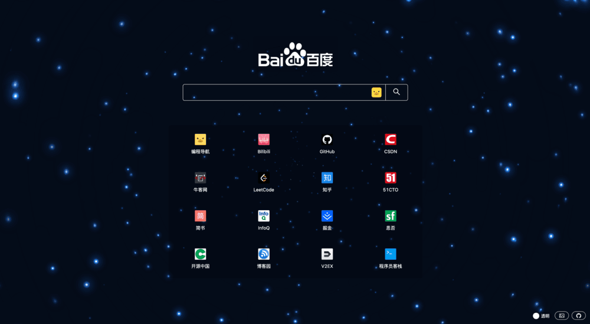
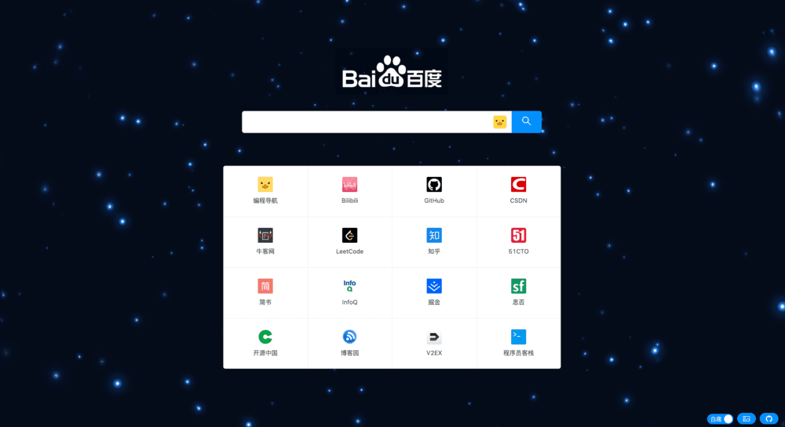
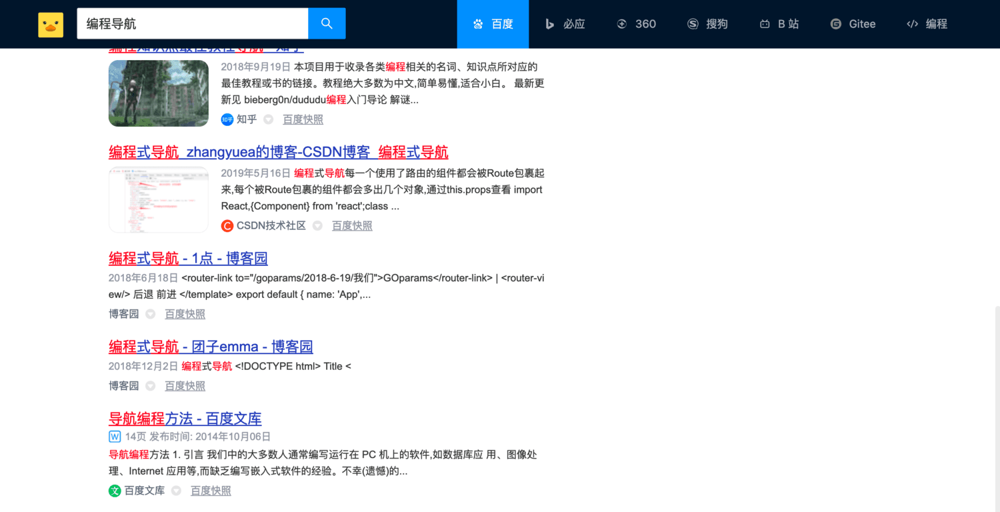

# [编程导航 - 程序员必备主页](https://github.com/liyupi/code-nav/tree/master/code-nav-home)

极简炫酷的浏览器主页！支持一键使用多个搜索引擎，主页内置了一些程序员必备优质站点，提升效率，还可以切换主题、定制壁纸等。

在线体验：https://home.code-nav.cn

开发过程：[奇思妙想，动手 DIY 你的浏览器主页](https://mp.weixin.qq.com/s/YrCXnYrNw5a0sKiGtpFfHw)

🔧 [试试一键部署吧！](#%E9%83%A8%E7%BD%B2)

<br/>

## 开发者信息

本应用由 [程序员鱼皮](https://github.com/liyupi) 开发提供 🐟

<br/>

## 使用

### 项目展示

透明主页



白底主页



万能搜索


万能搜索结果页



切换壁纸


随机壁纸


动态壁纸


## 已有功能

1. 切换搜索
2. 万能搜索
3. 切换壁纸
4. 动态壁纸
5. 随机壁纸
6. 透明模式

<br/>

## 部署

本项目基于腾讯开源项目 [CloudBase Framework](https://github.com/Tencent/cloudbase-framework) [](https://github.com/Tencent/cloudbase-framework) 开发部署，支持一键云端部署！

点击下方按钮，无需任何操作，即可部署应用 ⬇️

[](https://console.cloud.tencent.com/tcb/env/index?action=CreateAndDeployCloudBaseProject&appUrl=https://github.com/liyupi/code-nav&workDir=code-nav-home&branch=master)

<br/>

## 开发

除了上述一键部署方式外，你也可以下载项目后，使用 [CloudBase CLI](https://docs.cloudbase.net/cli-v1/intro.html) 在终端中一键部署。

```
npx @cloudbase/cli framework deploy -e 环境id
```

### 快速开始

**请保证 Node.js 版本 > 10** ⚠️

1. 下载项目到本地

   ```bash
   git clone https://github.com/liyupi/code-nav.git
   ```

2. 进入目录，安装依赖

   ```bash
   cd code-nav-home
   npm install
   ```

3. 本地启动项目

   ```bash
   npm run start
   ```
   
   然后可以自由开发和定制主页！
   
4. 打包构建

   ```bash
   npm run build
   ```

   会生成 dist 目录，可以通过 [serve 工具](https://www.npmjs.com/package/serve) 本地启动 server 快速浏览。

5. 部署

   点击上述一键部署按钮可以轻松部署具有弹性扩缩容能力的默认网站应用！
   
   也可以利用腾讯云静态站点托管：可以直接将 `dist` 目录发布到 [静态站点托管](https://cloud.tencent.com/document/product/876/46900) 中，有 CDN 支持

   ```bash
   tcb hosting deploy . -e envId
   ```

<br/>

## 技术选型

### 前端

基于 [React-Static](https://github.com/react-static/react-static) 静态站点生成框架开发

1. React + React-Static 
2. [Ant Design](https://ant.design/index-cn) 组件库 + [Ant Design Pro 高级组件](https://procomponents.ant.design/components)
3. ESLint 检查
4. 随机壁纸使用搏天 API 接口 + JsonBird 代理跨域
5. 使用 iframe 实现壁纸切换和万能搜索

### 后端

后端使用 [腾讯云云开发](https://cloud.tencent.com/product/tcb) ，全量上云，充分利用了腾讯云提供的云计算能力。

1. 静态网站托管：CDN 全站加速，一键部署
2. 云存储：存储壁纸、模板文件等静态资源，同时用 CDN 加速
3. 云托管：使用云托管可以弹性扩缩容，上能应对流量洪峰，下能冷却节约成本
4. DNSPod：自定义域名解析，网页监控

<br/>

## 文档

- [CloudBase Framework 文档](https://docs.cloudbase.net/framework/)
- [编程导航文档](https://doc.code-nav.cn)

<br/>

## Licence

开源协议文档请参阅 [LICENSE](./LICENSE)
